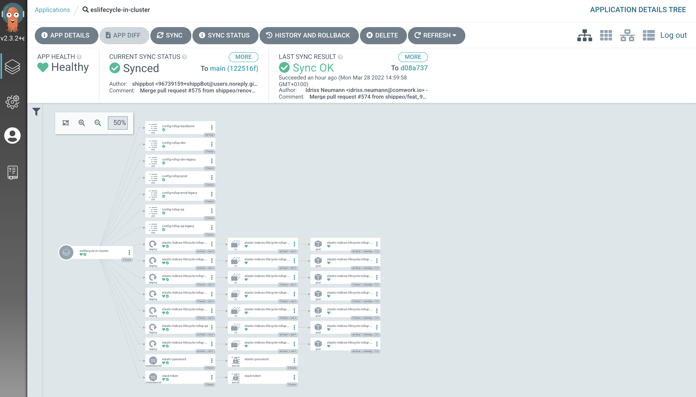

# Indices lifecycle utility for ElasticSearch

This project aims to provide a docker image that handle the rollup of elastic indices for you, in a cloud native or gitops way.

## Git repository

* main repo: https://gitlab.comwork.io/oss/elasticstack/elastic-indices-lifecycle
* github mirror backup: https://github.com/idrissneumann/elastic-indices-lifecycle
* gitlab mirror backup: https://gitlab.com/ineumann/elastic-indices-lifecycle

## Rollup service
### Docker repository

The docker hub repository is here: https://hub.docker.com/repository/docker/comworkio/elastic-indices-lifecycle

The image is built either for ARM and x86 architecture. 

You can use the following tags for x86:

```shell
docker pull comworkio/elastic-indices-lifecycle:latest # x86
docker pull comworkio/elastic-indices-lifecycle:1.0 # x86
docker pull comworkio/elastic-indices-lifecycle:1.0-{sha} # x86
docker pull comworkio/elastic-indices-lifecycle:1.0-x86 # x86
docker pull comworkio/elastic-indices-lifecycle:1.0-{sha}-x86 # x86
```

You can use the following tags for arm:

```shell
docker pull comworkio/elastic-indices-lifecycle:latest-arm # x86
docker pull comworkio/elastic-indices-lifecycle:1.0-arm # x86
docker pull comworkio/elastic-indices-lifecycle:1.0-{sha}-arm # x86
```

### Deployment with docker

You can either mount a [json configuration file](https://gitlab.comwork.io/oss/elastic-indices-lifecycle/-/blob/master/rollup_conf.json) or use environment variable instead.

Here the environment variable you can use with your container :

* `ES_LIFECYCLE_elastic_hosts`: elastic domain name or host
* `ES_LIFECYCLE_elastic_port`: elastic port
* `ES_LIFECYCLE_elastic_scheme`: elastic scheme (`http` or `https`)
* `ES_LIFECYCLE_elastic_username`: username (need to have all rights on the cluster)
* `ES_LIFECYCLE_elastic_password`: password
* `ES_LIFECYCLE_wait_time`: wait time in seconds to perform the rollup jobs (default: `43200` which equals 12h)
* `ES_LIFECYCLE_retention`: retention in days to remove the old indices (default: `30` days)
* `ES_LIFECYCLE_log_level`: log level `debug` or `info` (default: `info`)
* `ES_LIFECYCLE_should_slack`: `on` in order to enable Slack notification (default: `off`)
* `ES_LIFECYCLE_slack_token`: slack token
* `ES_LIFECYCLE_slack_username`: slack username to appear in the channels
* `ES_LIFECYCLE_slack_channel`: the channel
* `ES_LIFECYCLE_slack_emoji`: slack emoji that will be used as an avatar (default `:elastic:`, so you need to have an emoji that 
* `ES_LIFECYCLE_date_format`: the format of date that is used for your indices names (default: `%Y%m%d`, so your indices needs to looks like `{prefix}-20200101`)
* `ES_LIFECYCLE_date_separator`: the separator before the date in the name of indice (default value: `-`)
* `ES_LIFECYCLE_index_prefixes`: the beginning of your indice names with comma as separator (example: `logs,metrics` will match for all indices that begin with `logs` or `metrics`, like `logs-myapp-20202001` for example).
* `ES_LIFECYCLE_index_suffixes`: the end f your indice names with comma as separator (example: `logs,metrics` will match for all indices that end with `logs` or `metrics` just before the date, like `myapp-logs-20202001` for example).

## Backup service

### Docker repository

The docker hub repository is here: https://hub.docker.com/repository/docker/comworkio/elastic-indices-lifecycle-backup

The image is built either for ARM and x86 architecture. 

You can use the following tags for x86:

```shell
docker pull comworkio/elastic-indices-lifecycle-backup:latest # x86
docker pull comworkio/elastic-indices-lifecycle-backup:1.7 # x86
docker pull comworkio/elastic-indices-lifecycle-backup:1.7-{sha} # x86
docker pull comworkio/elastic-indices-lifecycle-backup:1.7-x86 # x86
docker pull comworkio/elastic-indices-lifecycle-backup:1.7-{sha}-x86 # x86
```

You can use the following tags for arm:

```shell
docker pull comworkio/elastic-indices-lifecycle-backup:latest-arm # x86
docker pull comworkio/elastic-indices-lifecycle-backup:1.7-arm # x86
docker pull comworkio/elastic-indices-lifecycle-backup:1.7-{sha}-arm # x86
```

### Deployment with docker

You can either mount a [json configuration file](https://gitlab.comwork.io/oss/elastic-indices-lifecycle/-/blob/master/backup_config.json) or use environment variable instead.

Here the environment variable you can use with your container :

* `ES_LIFECYCLE_elastic_config_url`: elastic api url (ex: `https://elasticsearch.xxxx.com/api` or `http://localhost:9200`)
* `ES_LIFECYCLE_elastic_username`: username (need to have all rights on the cluster)
* `ES_LIFECYCLE_elastic_password`: password
* `ES_LIFECYCLE_wait_time`: wait time in seconds to perform the rollup jobs (default: `43200` which equals 12h)
* `ES_LIFECYCLE_hostname`: the hostname
* `ES_LIFECYCLE_should_slack`: `on` in order to enable Slack notification (default: `off`)
* `ES_LIFECYCLE_slack_token`: slack token
* `ES_LIFECYCLE_slack_username`: slack username to appear in the channels
* `ES_LIFECYCLE_slack_channel`: the channel
* `ES_LIFECYCLE_slack_emoji`: slack emoji that will be used as an avatar (default `:elastic:`, so you need to have an emoji that 
* `ES_LIFECYCLE_elastic_backup_path`: the path of the backup in the filesystem (that can be a NFS mount point)
* `ES_LIFECYCLE_elastic_backup_repository`: backup repository name (default: `elastic_backup`)
* `ES_LIFECYCLE_fs_group`: linux group owner of the `ES_LIFECYCLE_elastic_backup_path`
* `ES_LIFECYCLE_fs_user`: linux user owner of the `ES_LIFECYCLE_elastic_backup_path`
* `ES_LIFECYCLE_log_level`: log level `debug` or `info` (default: `info`)

## Deployment with kubernetes

There will be a nice helm chart some days.

For now, you'll find an example of kubernetes yaml [here](./kubernetes) files using kustomize in order to deploy two environments in a gitops way.

You'll see that you'll also need to create the missing secrets (using SealedSecret if you want to stay completly gitops).

Here's the result of using this kustomize example on ArgoCD:



